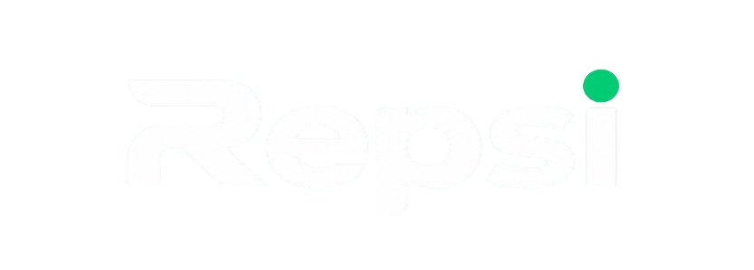

<div align="center">
  
  
  <h3>The Operating System for Modern Gyms & Fitness Businesses</h3>
  
  <p>
    REPSI is a production-grade Gym Management SaaS platform tailored for gym owners, trainers, staff, and members. Built with a modern design system, highly scalable multi-tenant architecture, local payment processing, and high-performance native apps.
  </p>

  <p>
    <a href="https://repsi.app">Live Web App</a> •
    <a href="#-getting-started">Get Started</a> •
    <a href="docs/architecture.md">Architecture</a> •
    <a href="https://github.com/nitheeshmk41/repsi/releases">Download Apps</a>
  </p>
  
  <p>
    
    
    
  </p>
</div>

---

## 🌟 About REPSI

Managing a fitness facility shouldn't mean juggling five different outdated software tools. **REPSI** unifies your entire gym operation into a single, cohesive platform:

- **Gym Owners**: Track real-time MRR, automated GST billing, multi-branch performance, and convert trial leads with built-in CRM.
- **Trainers**: Manage PT client sessions, assign digital workout routines, monitor macro diets, and view commission payouts.
- **Front Desk Staff**: Validate contactless QR check-ins in under a second and issue WhatsApp receipts instantly.
- **Members**: Check in via smartphone QR pass, log workout sets, track nutrition, and pay membership dues with 1-tap UPI.

---

## ✨ Key Features in v1.0.1

- 🏢 **Multi-Tenancy & Workspace Isolation**: Manage single or multi-branch gym networks under one organization with complete data isolation.
- 💳 **UPI & Cashfree Payment Integration**: Instant fee collection via Google Pay, PhonePe, BHIM UPI, cards, and automatic WhatsApp invoice delivery.
- 📲 **Contactless QR Attendance**: Sub-second smartphone QR scan check-in and biometric hardware integration.
- 🌐 **Product-Led SEO Architecture**: Built-in SEO engine covering dedicated feature routes (`/features/*`), comparisons (`/compare/*`), regional city hubs (`/cities/*`), and automated Google `LocalBusiness` schema for gym websites.
- 📱 **Native Mobile Apps (iOS & Android)**: Compiled Flutter applications with Riverpod state management and offline-resilient storage.
- 💻 **Desktop Apps (Tauri & Rust)**: Lightweight, native desktop wrappers for Windows, macOS, and Linux.
- 📊 **Real-time Analytics & CRM**: Sales pipeline tracking, trial lead follow-up drip sequences, churn analysis, and financial reporting.

---

## 🛠️ Technology Stack

| Layer | Technology | Description |
|---|---|---|
| **Web Frontend** | Next.js 16, React 19, Tailwind CSS v4 | Server-rendered, SEO-optimized web application. |
| **Mobile App** | Flutter 3.x, Dart, Riverpod, Dio | High-performance compiled native apps for iOS and Android. |
| **Desktop App** | Tauri, Rust | Lightweight native desktop wrapper for Windows, Mac, and Linux. |
| **Backend API** | FastAPI, Python 3.12, SQLAlchemy | Asynchronous, type-safe REST API with tenant context isolation. |
| **Database** | PostgreSQL, SQLite | Relational database modeling with automated migrations. |
| **Infrastructure** | Docker, GitHub Actions | Multi-platform CI/CD release automation for APKs and Desktop binaries. |

---

## 📁 Monorepo Structure

```text
repsi/
├── app/
│   ├── web/             # Next.js frontend & Gym Website Builder engine
│   ├── api/             # FastAPI backend microservices
│   ├── mobile/          # Flutter cross-platform app (iOS & Android)
│   └── desktop/         # Tauri Rust desktop app wrapper
│
├── docker/              # Container definitions
├── docs/                # Architecture diagrams and system specs
├── .github/workflows/   # CI/CD pipelines (Automated APK, AppImage, EXE releases)
└── docker-compose.yml   # Multi-container orchestration
```

---

## 🚀 Getting Started

### Prerequisites
- [Node.js](https://nodejs.org/) (v20+)
- [Python](https://www.python.org/) (v3.12+) and `uv`
- [Flutter SDK](https://flutter.dev/) (v3.x)
- [Rust](https://www.rust-lang.org/) (for Desktop builds)

### 1. Backend API (FastAPI with uv)
```bash
cd app/api
uv sync
uv run uvicorn app.main:app --reload --port 8000

# Run tests
uv run pytest

# Run seeds
uv run python -m app.core.seed
```

### 2. Web Frontend (Next.js)
```bash
cd app/web
npm install
npm run dev
```

### 3. Mobile App (Flutter)
```bash
cd app/mobile
flutter pub get
flutter run
```

### 4. Desktop App (Tauri)
```bash
cd app/desktop
npm install
npm run dev
```

---

## 📦 Multi-Platform Releases (v1.0.1)

REPSI uses automated GitHub Actions workflows to build release binaries upon pushing tag `v1.0.1`:

- **Android**: Downloadable `.apk`
- **Linux**: `.AppImage` & `.deb` packages
- **Windows**: `.exe` & `.msi` installers
- **macOS**: `.dmg` bundles

To trigger a new build & release:
```bash
git tag -a v1.0.1 -m "Release v1.0.1"
git push origin v1.0.1
```

---

## 📄 License

**Proprietary Software** — All rights reserved. 
Unauthorized copying, modification, or distribution is strictly prohibited.
